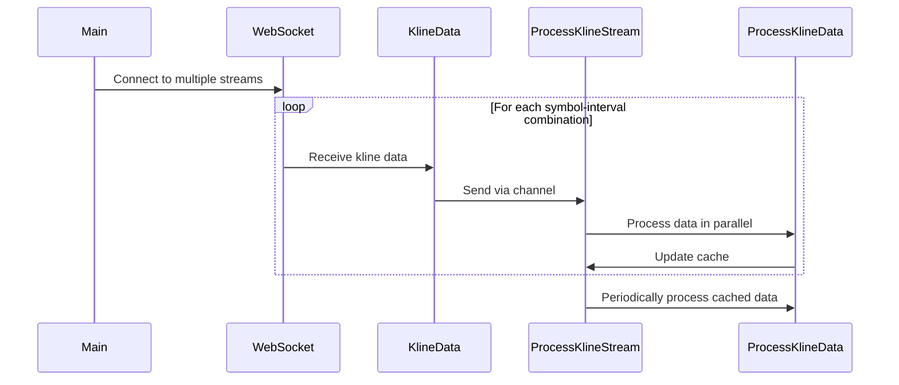

# Crypto Kline Tracker


This Go application connects to the Binance WebSocket API to retrieve real-time kline (candlestick) data for multiple cryptocurrency pairs and intervals. It processes the data in parallel and provides continuous updates on price changes.

## Features

- Connects to multiple Binance WebSocket streams simultaneously
- Processes kline data for multiple symbol-interval combinations
- Utilises parallel processing for improved performance
- Provides real-time updates on price changes and other metrics

## Prerequisites

- Go 1.15 or higher
- `github.com/gorilla/websocket` package
- `github.com/pkg/errors` package

## Installation

1. Clone the repository:
   ```
   git clone https://github.com/arturogonzalezm/crypto_kline_tracker_go.git
   ```

2. Change to the project directory:
   ```
   cd crypto_kline_tracker_go
   ```

3. Install dependencies:
   ```
   go get github.com/gorilla/websocket
   go get github.com/pkg/errors
   ```

## Usage

Run the application using:

```
go run main.go
```

The application will start connecting to the Binance WebSocket streams for the predefined symbols and intervals, and begin processing and displaying the kline data.

## Project Structure

The main components of the application are:

- `KlineData`: Struct to hold kline data
- `newKlineData`: Function to create a new KlineData instance
- `runWebsocket`: Function to manage WebSocket connections
- `processKlineData`: Function to process and display individual kline data
- `processKlineStream`: Function to manage parallel processing of kline data
- `main`: Entry point of the application

## Sequence Diagram

The following sequence diagram illustrates the flow of data in the application:



## Customisation

You can customise the symbols and intervals by modifying the `symbols` and `intervals` slices in the `main` function:

```go
symbols := []string{"btcusdt", "ethusdt", "bnbusdt", "adausdt", "dogeusdt"}
intervals := []string{"1m", "5m", "15m"}
```

## Error Handling

The application includes error handling for WebSocket connections and data parsing. Errors are logged to the console for debugging purposes.

## Contributing

Contributions are welcome! Please feel free to submit a Pull Request.

## License

This project is licensed under the MIT License - see the LICENSE file for details.
